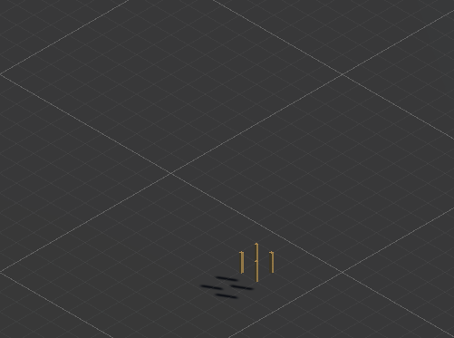
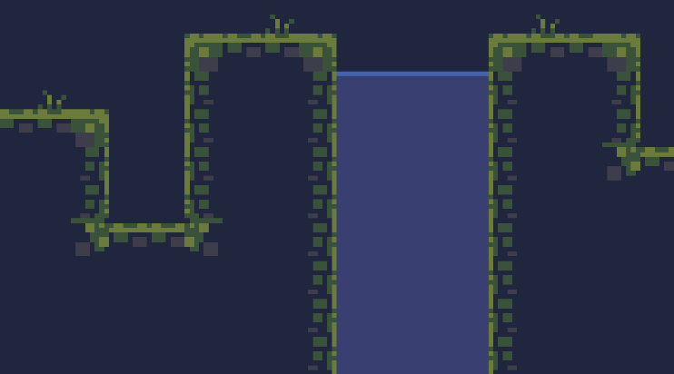

# Wave Function Collapse Demo
Procedual Content Generation demo with tile-based WFC in Unity both 2D & 3D.

## Resources

2D tile assets used in this demo are free assets from itch.io:
- https://adamatomic.itch.io/cavernas
- https://pixel-poem.itch.io/dungeon-assetpuck

3D voxel assets are created with [MagicaVoxel](https://ephtracy.github.io/), 
voxel files available in `/Design`

